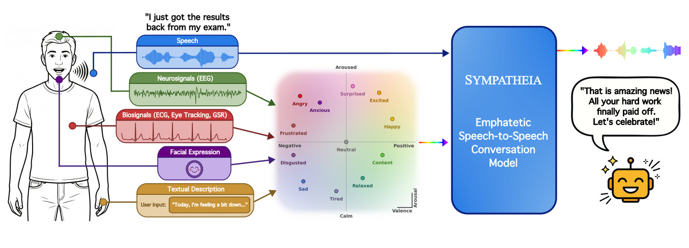

# Sympatheia: Emotionally Adaptive Voice Assistant with Continuous Affect Conditioning

> *Anonymous submission: Code, demo, and dataset links use anonymized identifiers.*

[[Paper]](sympatheia.pdf) &nbsp;|&nbsp; [[Demo]](https://anonymous.4open.science/w/sympatheia-9327/) &nbsp;|&nbsp; [[Dataset (Sympatheia-18k)]](https://huggingface.co/datasets/anonymous2222/Sympatheia-18k) &nbsp;|&nbsp; [[Model]](https://huggingface.co/anonymous2222/Sympatheia)

---

Sympatheia is a speech-to-speech empathetic dialogue framework that conditions response generation on **continuous valence–arousal (VA) affect signals** inferred from the user's spoken query and, when available, from pluggable external emotion sensing modules (face, EEG/physiological signals, textual affect descriptions). The model is built on [GLM-4-Voice-9B](https://huggingface.co/THUDM/glm-4-voice-9b) and fine-tuned on **Sympatheia-18k**, a synthetic corpus of 18k emotion-conditioned spoken dialogue pairs spanning 12 emotion anchors.



---

## Setup

### 1. Clone and install dependencies

```bash
git clone https://anonymous.4open.science/r/sympatheia-9327
cd sympatheia
pip install -r requirements.txt
```

> **Note:** The CosyVoice TTS components in `src/cosyvoice/` require `matcha-tts`, `conformer`, `phonemizer`, and `hyperpyyaml`, which are included in `requirements.txt`. The dataset creation pipeline additionally requires the [Qwen3-TTS](https://huggingface.co/Qwen/Qwen3-TTS) package (`qwen_tts`), and the evaluation judge scripts require [Qwen3-Omni](https://github.com/QwenLM/Qwen3). Install these separately if you plan to re-generate the dataset or run the LLM judge.

### 2. Download decoder weights

Download `flow.pt` and `hift.pt` from the [GLM-4-Voice decoder page](https://huggingface.co/THUDM/glm-4-voice-decoder) and place them in `src/glm-4-voice-decoder/`:

```bash
# Using huggingface_hub
python -c "
from huggingface_hub import hf_hub_download
hf_hub_download('THUDM/glm-4-voice-decoder', 'flow.pt', local_dir='src/glm-4-voice-decoder')
hf_hub_download('THUDM/glm-4-voice-decoder', 'hift.pt', local_dir='src/glm-4-voice-decoder')
"
```

### 3. Base language model

The base model `THUDM/glm-4-voice-9b` is downloaded automatically from HuggingFace during training or inference. Ensure you have a HuggingFace account and internet access, or pre-cache it with:

```bash
python -c "from transformers import AutoModel; AutoModel.from_pretrained('THUDM/glm-4-voice-9b')"
```

---

## Pretrained Model Weights

The Sympatheia LoRA adapter checkpoint is available at [huggingface.co/anonymous2222/Sympatheia](https://huggingface.co/anonymous2222/Sympatheia).

```bash
# Download checkpoint
huggingface-cli download anonymous2222/Sympatheia --local-dir /path/to/checkpoint
```

Download the checkpoint folder and place it anywhere convenient -- the inference and evaluation scripts accept a `--checkpoint` argument pointing to the folder.

---

## Dataset: Sympatheia-18k

The full dataset is available at [huggingface.co/datasets/anonymous2222/Sympatheia-18k](https://huggingface.co/datasets/anonymous2222/Sympatheia-18k).

Sympatheia-18k consists of two complementary splits:

- **Emotional split** (~12k examples): Affect-rich user queries paired with emotion-appropriate spoken responses, ~1k examples per emotion. Teaches semantic and acoustic emotional alignment.
- **Neutral split** (~6k examples): 500 emotionally neutral queries each paired with 12 emotion-conditioned responses (one per anchor). Teaches explicit VA-controlled affect generation when speech is neutral or ambiguous.

The dataset was generated using Qwen3-32B (text) and Qwen3-TTS (speech) with emotion-specific style and response strategy controls.

If you want to re-generate the dataset, the full pipeline is in `src/dataset_creation/`. See [Dataset Creation](#dataset-creation) below.

---

## Training

Training fine-tunes GLM-4-Voice-9B with LoRA on Sympatheia-18k. All hyperparameters are in `src/config.yaml`; the DeepSpeed Stage 3 config is in `src/ds_config.json`.

```bash
cd src
# Single-node, 4-GPU (adjust --num_processes for your setup)
accelerate launch --config_file ds_config.json \
    --num_processes 4 \
    train_sympatheia.py
```

Or directly with DeepSpeed:
```bash
cd src
deepspeed --num_gpus=4 train_sympatheia.py
```

Checkpoints are saved to `src/experiments/{run_name}/checkpoint-{step}/`.

---

## Inference

`inference_sympatheia.py` generates audio responses for all 12 emotion anchors plus interpolations (happy↔sad, anxious↔relaxed) and the no-VA baseline.

```bash
cd src

# Run inference on a downloaded checkpoint
python inference_sympatheia.py \
    --checkpoint /path/to/checkpoint

# Or sweep multiple checkpoints from a training run
python inference_sympatheia.py \
    --experiment-dir experiments/<run-name> \
    --checkpoints <step1> <step2> <step3>
```

Outputs are written to `checkpoint-{step}/results_12emo/` as `output_{emotion}_v{val:.2f}_a{aro:.2f}.wav`.

**Emotion comparison mode** (generates with-VA vs. no-VA responses for a set of eval queries):
```bash
python inference_sympatheia.py \
    --checkpoint /path/to/checkpoint \
    --compare-mode \
    --eval-audio-dir /path/to/eval/audio
```

---

## Interactive Demo

```bash
cd src
python gradio_demo.py \
    --checkpoint /path/to/checkpoint \
    --port 7860
```

The demo supports four emotion input modes:

- **Select Manually**: 12 emotion presets (angry, anxious, content, disgusted, excited, frustrated, happy, neutral, relaxed, sad, surprised, tired) via dropdown, plus fine-grained valence and arousal sliders.
- **Detect From Audio**: no VA injection; the model uses its own built-in emotion detection from the user's speech.
- **Describe Your Feeling**: enter a free-text description of how you feel and it is automatically mapped to valence/arousal via a language model.
- **Detect From Face**: stream webcam video; audio goes to the speech model and face expressions from the video are analyzed for emotion automatically. A static face image upload is also supported.

By default the demo creates a public Gradio share link, so it can be accessed from a browser on a different machine. Pass `--ssl` to enable HTTPS for microphone access.

---

## Evaluation

The evaluation pipeline has two stages: (1) generating model responses for each condition and (2) scoring them with an audio-capable LLM judge (Gemini or Qwen3-Omni).

All evaluation scripts are under `src/eval/`. Run them from `src/`.

### Stage 1a: Generate responses -- Neutral query setting

The neutral setting evaluates whether the model adapts its response when the user audio is neutral but the system prompt specifies a target emotion.

```bash
cd src
python eval/generate_responses/sympatheia_neutral/generate_responses_neutral_sympatheia.py \
    --finetuned-experiment experiments/<run-name> \
    --checkpoint-step <step> \
    --num-samples 100 \
    --emotions angry anxious content disgusted excited frustrated happy neutral relaxed sad surprised tired
```

Outputs: `{eval_output_dir}/finetuned_va/` and `{eval_output_dir}/finetuned_na/` audio files + `manifest.jsonl`.

### Stage 1b: Generate responses -- Emotional query setting

The emotional setting evaluates empathetic response when the user audio itself carries the target emotion.

```bash
cd src
python eval/generate_responses/sympatheia_emotional/generate_responses_emotional_sympatheia.py \
    --finetuned-experiment experiments/<run-name> \
    --checkpoint-step <step> \
    --num-samples 100 \
    --emotions angry anxious content disgusted excited frustrated happy neutral relaxed sad surprised tired
```

Outputs: same structure as neutral setting.

### Stage 2: LLM-as-a-judge scoring

Two judges are provided. Both listen to the same generated audio and score it on the same 1--5 rubric with byte-identical prompts, so the only variable between them is the judge model.

**Gemini** (hosted API):

```bash
cd src
export GEMINI_API_KEY=...   # or put it in a .env file at the repo root

# Neutral setting judge
python eval/judge/judge_gemini_neutral.py \
    --manifest /path/to/manifest.jsonl \
    --conditions finetuned_va finetuned_na

# Emotional setting judge
python eval/judge/judge_gemini_emotional.py \
    --manifest /path/to/manifest.jsonl \
    --conditions finetuned_va finetuned_na
```

Outputs: `judgments_gemini.jsonl` + `summary_gemini.json` with mean scores per condition and emotion.

**Qwen3-Omni** (local, no API cost):

```bash
cd src
# Neutral setting judge
python eval/judge/judge_qwen3omni_neutral.py \
    --manifest /path/to/manifest.jsonl \
    --conditions finetuned_va finetuned_na

# Emotional setting judge
python eval/judge/judge_qwen3omni_emotional.py \
    --manifest /path/to/manifest.jsonl \
    --conditions finetuned_va finetuned_na
```

Outputs: `judgments.jsonl` + `summary.json` with mean scores per condition and emotion.

> **Gemini judge:** Requires `google-genai` (in `requirements.txt`) and an API key in `GEMINI_API_KEY` or `GOOGLE_API_KEY`. Select a different model with `--model`.

> **Qwen3-Omni judge:** The judge scripts expect a local Qwen3-Omni model. Point the `--model-path` argument to your local copy, or set the default path in the script.

> **Baseline model requirements:** `requirements.txt` covers only Sympatheia's training and inference pipeline. Each baseline evaluation script requires the corresponding model to be installed separately; refer to each model's own repository for setup instructions.

---

## Dataset Creation

The full Sympatheia-18k generation pipeline is in `src/dataset_creation/`. Scripts must be run in order.

### Part 1: Emotional split (affect-rich queries + responses)

```bash
cd src/dataset_creation

# 1. Generate emotion-conditioned text pairs with Qwen3-32B
python generate_new_text_pairs.py

# 2. Synthesize emotion-styled audio with Qwen3-TTS (multi-GPU)
python generate_qwen3tts_audio_12emo_multigpu.py

# 3. Encode audio and convert to GLM-4-Voice token format
python convert_qwen3tts_to_glm4voice_12emo.py

# 4. Validate the resulting dataset
python validate_dataset_12emo.py
```

### Part 2: Neutral split (neutral queries × 12 response emotions)

```bash
# 1. Generate neutral queries with 12 emotion response variants
python generate_part2_text_pairs.py

# 2. Synthesize audio (multi-GPU)
python generate_part2_audio_multigpu.py

# 3. Convert to GLM-4-Voice token format
python convert_part2_to_glm4voice.py

# 4. Validate
python validate_part2_dataset.py

# Or run the full Part 2 pipeline in one go:
bash run_part2_pipeline.sh
```

Then merge both splits:
```bash
python merge_splits.py
```

---

## Emotion Sensing Modules

Each sensing module in `src/integration/` outputs a softmax distribution over its native emotion taxonomy, which is mapped to a VA coordinate via probability-weighted anchor averaging (Eq. 1 in the paper).

| Module | Directory | Dataset |
|--------|-----------|---------|
| Facial expression | `integration/face_module/` | AffectNet+ |
| EEG + Eye tracking | `integration/seed_module/` | SEED-VII |
| ECG + GSR | `integration/yaad_module/` | YAAD |
| Textual affect description | `integration/text_module/` | ISEAR |

Sensing module integration experiments and end-to-end evaluations are in `src/integration/`.

---

## Project Structure

```
sympatheia/
├── README.md
├── requirements.txt
├── sympatheia.pdf
└── src/
    ├── train_sympatheia.py          # LoRA fine-tuning entry point
    ├── inference_sympatheia.py      # Batch inference with VA conditions
    ├── gradio_demo.py               # Interactive Gradio demo
    ├── config.yaml                  # Training hyperparameters
    ├── ds_config.json               # DeepSpeed ZeRO Stage 3 config
    ├── constants.py                 # 12-emotion VA anchor mapping
    ├── speech_tokenizer/            # WhisperVQ speech tokenizer
    ├── cosyvoice/                   # Flow-matching speech decoder components
    ├── vocoder_src/                 # GLM-4-Voice vocoder utilities
    ├── glm-4-voice-decoder/         # Decoder weights (flow.pt, hift.pt)
    ├── dataset_creation/            # Sympatheia-18k generation pipeline
    ├── figure/                      # Figures
    │   └── overview.png
    ├── integration/                 # Emotion sensing modules
    │   ├── face_module/             # HSEmotion facial expression classifier
    │   ├── seed_module/             # MAET EEG + eye tracking (SEED-VII)
    │   ├── yaad_module/             # ResNet1D ECG + GSR (YAAD)
    │   └── text_module/             # DistilRoBERTa textual affect
    ├── eval/
    │   ├── generate_responses/      # Response generation scripts per model
    │   │   ├── sympatheia_neutral/  # Neutral-query evaluation
    │   │   ├── sympatheia_emotional/# Emotional-query evaluation
    │   │   └── interpolation/       # VA intensity and inter-emotion ramps
    │   ├── judge/                   # Qwen3-Omni and Gemini LLM-as-a-judge scripts
    │   └── metrics/                 # Prosody, coherence, naturalness, interpolation
    ├── figures/                     # Figure generation scripts
    ├── experiments/                 # Training checkpoints (created at runtime)
    └── docs/                        # GitHub Pages demo site
```

---

## Responsible Use

Sympatheia is intended to make spoken assistants more emotionally aware and supportive. Users and deployers should be aware of the following:

- **Opt-in sensing only.** External affect signals (face, physiological, voice) constitute sensitive personal data. Any real-world deployment should use opt-in consent, disclose what signals are collected and how they are used, and allow users to disable or override affect conditioning at any time.
- **No covert surveillance.** This system must not be used for covert emotion sensing, protected-attribute inference, eligibility decisions, or clinical diagnosis without separate validation and governance.
- **Upstream estimate quality.** Incorrect affect estimates from sensing modules can produce over- or under-calibrated responses. Physiological signals in particular are noisy and subject-dependent. Evaluate sensing accuracy on the intended user population before deployment.
- **No universal VA mapping.** The emotion anchors and VA coordinates used here are practical design choices, not universal psychological truths. Affect varies across speakers, cultures, and contexts.

---

## License

The Sympatheia code is released under the Apache 2.0 License. The Sympatheia-18k dataset is released under CC BY 4.0. The GLM-4-Voice base model is subject to the [GLM-4-Voice License](https://huggingface.co/THUDM/glm-4-voice-9b).
